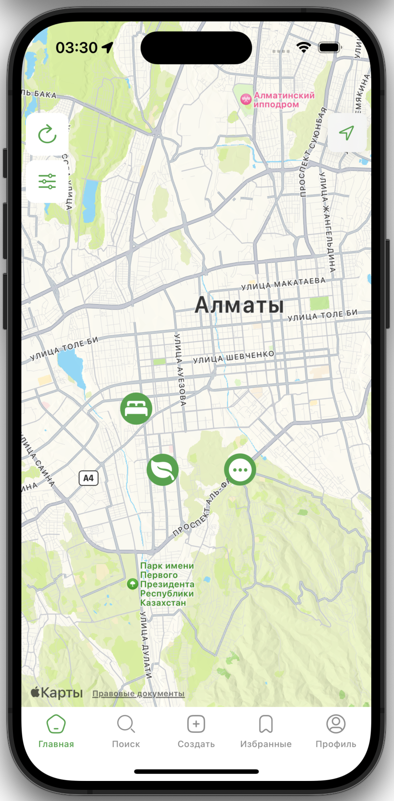
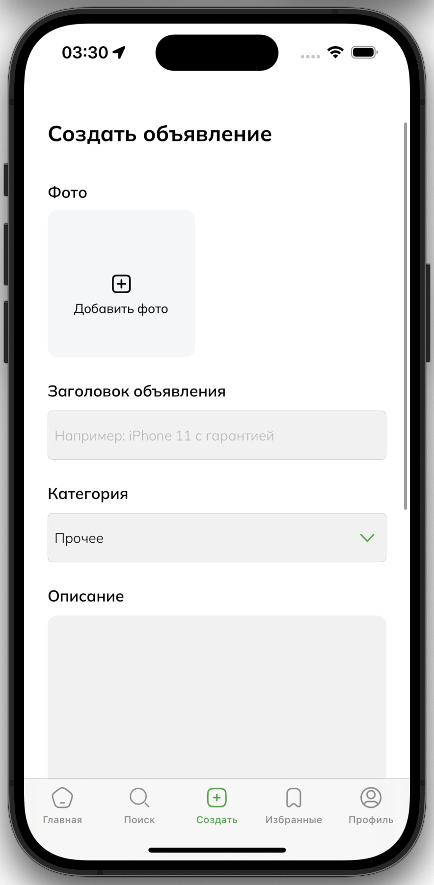

# Mapster

Welcome to **Mapster** – an innovative platform that allows users to register and post advertisements directly on a map. With Mapster, you can view and interact with other users' advertisements, making it a seamless and visually engaging experience.

## Features

- **User Registration**: Sign up to start posting and interacting with advertisements.
- **Post Advertisements**: Create ads with a title, category, photos, price, description, address, and a pinpoint on the map.
- **Browse Ads on the Map**: Explore advertisements directly on the map to find exactly what you’re looking for.
- **Interactive Map**: An intuitive map interface for easy navigation and interaction with advertisements.
- **Categorized Listings**: Filter ads by categories to find relevant listings quickly.
- **Detailed Ad Information**: Each ad includes a title, category, photos, price, description, address, and map pointer for complete information.

## Screenshots

<p align="center">
   
   
   
   
   
   
</p>

## Installation

To get started with Mapster, follow these steps:

**1. Clone the repository:**
   ```bash
   git clone https://github.com/getmemd/mapster.git
   ```
**2. Install spm modules in Xcode**

## Technologies Used

- **iOS App**: Swift, UIKit, MapKit
- **Backend**: Firebase
- **Database**: Firestore Database
- **Authentication**: Firebase Auth

## Contact

For any questions or feedback, please open an issue on GitHub or contact me at [a.medeuyev@icloud.com](mailto:a.medeuyev@icloud.com).
